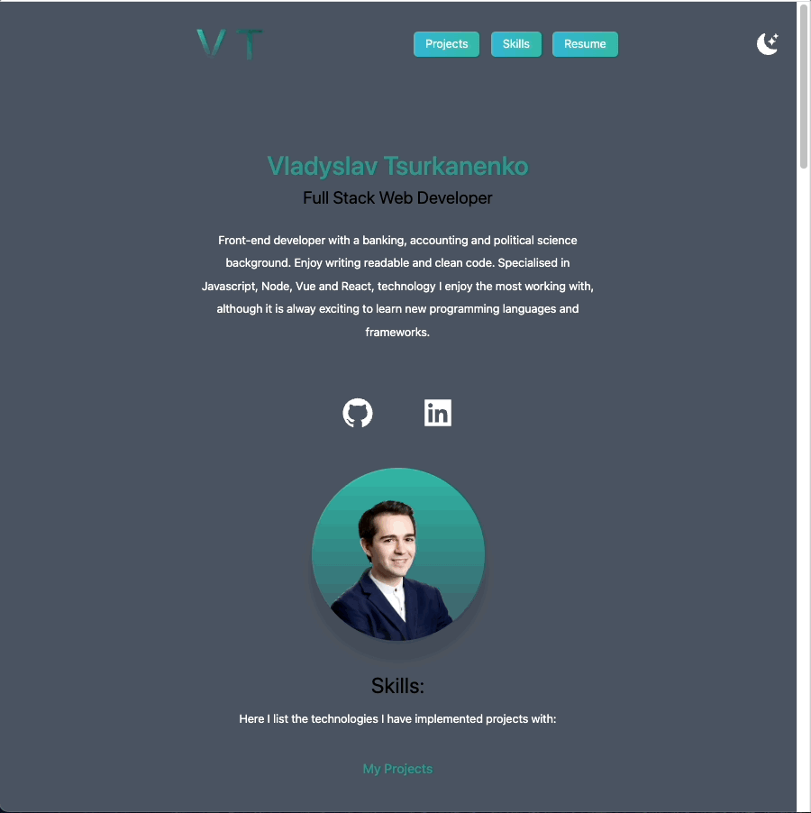

## My portfolio website

This is my portfolio website to reflect on the projects I've created so far.

You can find my contact information there and write me an email directly from the webpage.

The technologies I used to implement this page are: Next.js, TailwindCSS, TypeScript, Framer Motion, Ticker Library (react-fast-marquee), GitHub API and Emailjs!

It includes an option to donate using a Stripe payment as well.

###

correcting the theme colors